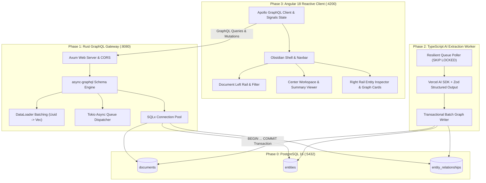

# 🌿 Trellis — Distributed Architecture Knowledge Graph Platform

> An enterprise-grade, polyglot monorepo platform that ingests unstructured technical RFCs and architecture specifications, extracts architectural entities and directional dependency graphs via AI structured outputs, and renders real-time reactive graph visualizations.

---

## 🏛️ System Architecture



---

## 📦 Monorepo Workspace Structure

| Package / Directory | Technology Stack | Description |
| :--- | :--- | :--- |
| **`docker/`** | PostgreSQL 16, SQL DDL | Schema initialization (`documents`, `entities`, `entity_relationships`, indexes, enums). |
| **`apps/server/`** | Rust, Axum 0.8, async-graphql 7.0, SQLx 0.7 | High-throughput GraphQL gateway with compile-time type safety and N+1 DataLoader batching. |
| **`apps/worker/`** | TypeScript, Vercel AI SDK, Zod, pg | Resilient asynchronous queue consumer with deterministic offline fallback and transactional consistency. |
| **`apps/web/`** | Angular 18, Apollo Angular, Tailwind CSS, Signals | Obsidian dark-themed single-page app with reactive signals, DM Sans typography, and micro-animations. |

---

## 🚀 Quick Start Guide

### Prerequisites
- **Node.js**: `v20.x` or higher
- **Rust**: `stable-x86_64-pc-windows-gnu` / `stable` with Cargo
- **Docker & Docker Compose**: For local PostgreSQL 16 container

---

### Step 1: Start Infrastructure & PostgreSQL Database

```bash
docker compose up -d
```
*Initializes database `trellis` at `localhost:5432` with user `postgres` / password `postgres` and schema tables.*

---

### Step 2: Launch Rust GraphQL Gateway

```bash
cd apps/server
cargo run
```
- **GraphQL Endpoint:** `http://localhost:8080/graphql`
- **Embedded GraphiQL Playground:** `http://localhost:8080/graphql`
- **Health Check:** `http://localhost:8080/health`

---

### Step 3: Launch TypeScript AI Ingestion Worker

```bash
cd apps/worker
npm install
npm run dev
```
*Worker begins polling PostgreSQL queue with advisory locking (`FOR UPDATE SKIP LOCKED`). If `OPENAI_API_KEY` is not set, it seamlessly activates the built-in deterministic heuristic knowledge extractor.*

---

### Step 4: Launch Angular 18 Web Client

```bash
cd apps/web
npm install
npm start
```
*Access the Trellis web interface at `http://localhost:4200`.*

---

## 🎯 Demo Architecture RFC Verification

1. In the Web UI (`http://localhost:4200`), click **`+ Ingest Spec`**.
2. Click **`⚡ Load RFC 404 Spec`** to populate the reference sample:
   ```text
   Title: RFC 404: Distributed Event Broker Architecture
   Content:
   The Trellis Event Broker service interfaces directly with the Ingestion Gateway via gRPC and buffers incoming telemetry into an AWS SQS queue. The Telemetry Ingestion Worker consumes messages from SQS, executes payload validation against strict schemas, and writes compressed traces to the PostgreSQL Primary Cluster. To reduce query latency, the Authentication Service caches active JSON Web Tokens within Redis Memory Store, while an AWS S3 Bucket provides durable object storage for raw diagnostic dumps.
   ```
3. Click **`Enrich Knowledge Graph ➔`**.
4. Observe the real-time status transitions: `QUEUED (Amber pulse)` ➔ `PROCESSING (Cyan spin)` ➔ `COMPLETED (Emerald solid)`.
5. Inspect the extracted entities:
   - `Trellis Event Broker` (SERVICE)
   - `Ingestion Gateway` (SERVICE)
   - `AWS SQS` (INFRASTRUCTURE)
   - `Telemetry Ingestion Worker` (SERVICE)
   - `PostgreSQL Primary Cluster` (DATA_MODEL)
   - `Authentication Service` (SERVICE)
   - `Redis Memory Store` (DATA_MODEL)
   - `AWS S3 Bucket` (INFRASTRUCTURE)
6. Switch to the **`Graph`** tab to view directional dependency flow cards:
   - `Trellis Event Broker ──( BUFFERS_INTO )──► AWS SQS`
   - `Telemetry Ingestion Worker ──( CONSUMES_FROM )──► AWS SQS`
   - `Telemetry Ingestion Worker ──( WRITES_TO )──► PostgreSQL Primary Cluster`
   - `Authentication Service ──( CACHES_INTO )──► Redis Memory Store`

---

## 🛡️ Key Architectural & Engineering Highlights

- **Zero N+1 Query Overhead:** Rust backend implements `DataLoader<EntityLoader>` and `DataLoader<RelationshipLoader>` to batch and deduplicate database lookups across nested GraphQL queries.
- **Rollback Safety & Advisory Locking:** Worker executes atomic transactions (`BEGIN ... COMMIT`) and uses `FOR UPDATE SKIP LOCKED` for concurrent multi-instance scale without duplicate job execution.
- **Fine-Grained Reactivity:** Angular 18 standalone components with Angular Signals (`signal`, `computed`) ensure surgical UI re-renders without full-tree dirty checking.
- **Strict Data Contracts:** 100% synchronized schema definitions across PostgreSQL DDL, async-graphql SDL, TypeScript Zod contracts, and Angular interface models.

---

## 📄 License
MIT License. Created for Trellis Architecture Platform.
