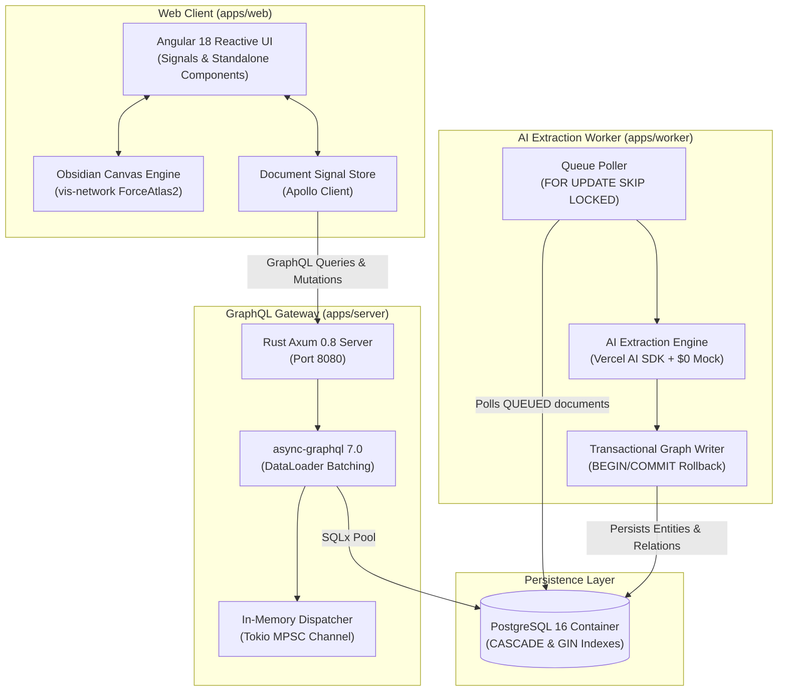

# Trellis

> **Interactive Concept Mapping & Document Intelligence Platform**

Trellis transforms dense, unstructured documents—everyday articles, study materials, research papers, and technical RFCs—into fluid, interactive visual concept maps and executive summaries.

---

## 🏛️ System Architecture



---

## ⚡ Key Capabilities

1. **Interactive Force-Directed Visual Canvas:**
   - Obsidian dark glassmorphic styling (`#070A0F` background, `#00E599` emerald accents).
   - Dynamic node category coloring (`CONCEPT`, `SYSTEM`, `SERVICE`, `DATA_MODEL`, `INFRASTRUCTURE`, `SECURITY_POLICY`).
   - Smooth cubic bezier directed edges with relationship action labels (e.g. `BLOCKS`, `POWERS`, `TRIGGERS`).
   - Real-time physics simulation with instant toggle, zoom, pan, and fit controls.

2. **Executive Summary & Concept Inspector Drawer:**
   - Plain-language executive breakdown accessible to non-technical readers.
   - Click-to-inspect concept drilldown with confidence score meter, key-value metadata attributes, and connected relationship lists.
   - Idempotent document reprocessing and deletion controls.

3. **$0 Zero-Cost Deterministic AI Pipeline:**
   - Works 100% offline out-of-the-box without requiring API keys or incurring credit costs.
   - Built-in multi-persona pattern extractors for science, history, and technical topics.
   - Seamless plug-and-play OpenAI / Groq LLM integration when `OPENAI_API_KEY` is provided.

---

## 🚀 Quick Start Guide

### Prerequisites
- [Node.js](https://nodejs.org/) (v20+ recommended)
- [Rust & Cargo](https://rustup.rs/) (1.78+)
- [Docker & Docker Compose](https://www.docker.com/)

---

### Step 1: Start PostgreSQL Infrastructure
```bash
docker compose up -d
```
*Validates database schema and GIN indexes on `localhost:5432`.*

---

### Step 2: Start Rust GraphQL Gateway
```bash
npm run dev:server
# or: cargo run --manifest-path apps/server/Cargo.toml
```
*Server runs on `http://localhost:8080` (Embedded GraphiQL IDE at `http://localhost:8080/graphql`).*

---

### Step 3: Start TypeScript AI Extraction Worker
```bash
npm run dev:worker
# or: npm --prefix apps/worker run dev
```
*Worker connects to PostgreSQL and continuously polls for queued extraction jobs.*

---

### Step 4: Start Angular 18 Web Client
```bash
npm run dev:web
# or: npm --prefix apps/web start
```
*Open [http://localhost:4200](http://localhost:4200) in your browser.*

---

## 🧪 Multi-Persona Verification Playbook

Trellis includes 3 built-in demo presets in the **Ingest Document** dialog:

| Preset | Target Persona | Focus Domain | Key Concepts |
| :--- | :--- | :--- | :--- |
| **☕ Everyday Science** | Casual Learner | Sleep Architecture & Adenosine | Caffeine, Adenosine Receptors, Sleep Pressure, Melatonin, Slow-Wave Sleep |
| **🚂 World History** | Humanities Student | Industrial Revolution & Steam Power | Steam Engine, Coal Mining, Iron Smelting, Railway Networks, Urbanization |
| **⚙️ Technical RFC** | Software Engineer | Distributed Event Brokers | Ingestion Gateway, Apache Kafka, Telemetry Worker, PostgreSQL, Redis |

### Verification Steps:
1. Open [http://localhost:4200](http://localhost:4200).
2. Click **`[+ Ingest Document]`** in the top navigation bar.
3. Click any of the **One-Click Demo Presets** to auto-populate title and raw prose.
4. Click **`Synthesize Graph`**:
   - Status badge transitions from `QUEUED` ➔ `PROCESSING` ➔ `COMPLETED`.
   - The knowledge graph animates into view on the canvas.
   - The right inspector renders an executive summary and concept attributes.
5. Click on any node on the canvas to inspect incoming/outgoing edges and confidence scores.

---

## 🛠️ Monorepo Commands

| Command | Action |
| :--- | :--- |
| `npm run build:server` | Validates & compiles Rust server (`apps/server`) |
| `npm run build:worker` | Compiles TypeScript AI Worker (`apps/worker`) |
| `npm run build:web` | Builds production Angular 18 client bundle (`apps/web`) |
| `npm run build` | Builds all packages across the monorepo |

---

## 📄 License
MIT License.
